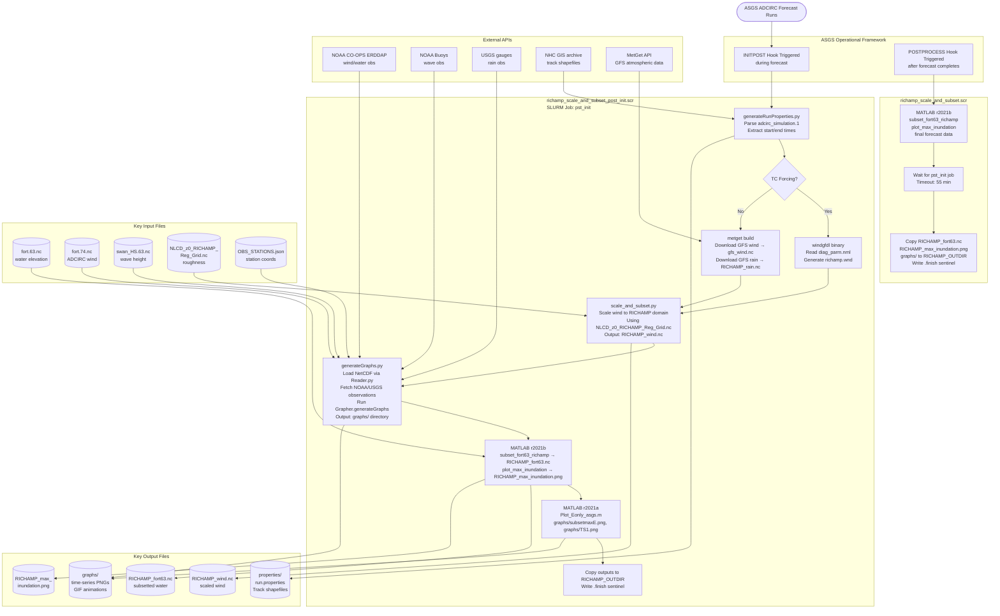

# Technical Documentation Report: `richamp-support-floodwater`

**Prepared for:** Arash Rafiee, URI  
**Date:** 2026-06-22  
**Repository:** `StormSurgeLive/richamp-support` (local branch: `richamp`)

---

## 1. Executive Summary

This codebase is the **post-processing engine for the RICHAMP (Rhode Island Coastal Hazards Monitoring and Prediction) system**, tightly integrated with the **ASGS (All-hazards Surge Guidance System)** operational storm-surge forecast platform.

**What it does:**  
When ASGS completes an ADCIRC/SWAN forecast for southern New England, this codebase automatically:

1. Extracts run metadata (start/end times, storm track) from ADCIRC output
2. Downloads GFS atmospheric forcing (or uses parametric NHC hurricane wind) via the MetGet API
3. **Scales and downscales wind fields** from coarse meteorological grids to the high-resolution RICHAMP domain, accounting for spatially varying land-surface roughness (`z0`)
4. Subsets the ADCIRC water-elevation output (`fort.63.nc`) to the RICHAMP region of interest
5. Generates a maximum storm-surge inundation map
6. Fetches real-time observations (NOAA CO-OPS tide/wind/wave gauges, USGS rain gauges) for model-vs.-observation comparison
7. Produces a set of publication-quality time-series and spatial plots for a real-time dashboard

**Main inputs:**  
ADCIRC `fort.63.nc` (water elevation), `fort.74.nc` (wind), `swan_HS.63.nc` (significant wave height), GFS meteorological NetCDF (from MetGet), `NLCD_z0_RICHAMP_Reg_Grid.nc` (roughness), `gfs-roughness.nc`, station JSON files, background map PNGs

**Main outputs:**  
`RICHAMP_fort63.nc` (subsetted water elevation), `RICHAMP_wind.nc` (scaled wind), `RICHAMP_max_inundation.png`, `graphs/` directory of time-series plots and maps, `properties/run.properties`, NHC track shapefiles

**General workflow:**  
ASGS triggers two parallel SLURM jobs — one running during the forecast and one after — that together execute a Python/MATLAB pipeline, then copy results to a dashboard output directory.

---

## 2. File Inventory

| File Name | Type / Language | Main Purpose | Important Inputs | Important Outputs | Notes |
|---|---|---|---|---|---|
| `richamp_scale_and_subset.sh` | Bash | ASGS POSTPROCESS hook — submits & monitors SLURM job | `POSTHOME` env var | `richamp_scale_and_subset.scr.{start,finish,error}`, log | Entry point after forecast finishes |
| `richamp_scale_and_subset.scr` | Bash / SLURM | Post-forecast batch job: MATLAB subset+plot, wait for post_init | `fort.63.nc`, `NLCD_z0_RICHAMP_Reg_Grid.nc` | `RICHAMP_fort63.nc`, `RICHAMP_max_inundation.png`, copies to `RICHAMP_OUTDIR` | Waits for post_init SLURM job |
| `richamp_scale_and_subset_post_init.sh` | Bash | ASGS INITPOST hook — submits post_init SLURM job | `POSTHOME` env var | `richamp_scale_and_subset_post_init.scr.submit`, log | Runs *during* forecast |
| `richamp_scale_and_subset_post_init.scr` | Bash / SLURM | Full post-init pipeline: MetGet fetch, wind scaling, graph generation, MATLAB | `adcirc_simulation.1`, GFS/NHC data, station JSONs | `RICHAMP_wind.nc`, `RICHAMP_rain.nc`, `graphs/`, `properties/`, `RICHAMP_max_inundation.png` | Longest-running script |
| `richamp_scale_and_subset_post_init.scr_original` | Bash | Backup of original init script | — | — | Reference copy only |
| `run.sh` | Bash | ecflow-based launcher (alternative to ASGS hooks) | `POST_ENV`, `ECF_NAME` env vars | Triggers post_init when correct scenario runs | Used in ecflow workflow context |
| `scriptgraph.sh` | Bash | Standalone testing script for graph generation | Hard-coded NetCDF paths | Calls `generateGraphs.py` | Development/debug tool |
| `localGenerator.sh` | Bash | Local (off-cluster) graph generation script | Local NetCDF files | `graphs/` | Used for testing without ASGS |
| `scenarioFileGenerator.sh` | Bash | Generates scenario configuration files | Scenario parameters | Scenario config files | Utility |
| `runw.sh` | Bash | Launcher for wind-only processing | Wind NetCDF | Wind output | Utility |
| `generateGraphs.py` | Python | Main visualization orchestrator | Station JSON, NetCDF files, `--backgroundChoice`, `--tempDir` | PNG graphs in `graphs/`, JSON intermediates in `tempDir` | Called by `richamp_scale_and_subset_post_init.scr` |
| `generateRunProperties.py` | Python | Extracts run metadata; downloads NHC track shapefiles | `adcirc_simulation.1`, `fort.22` | `properties/run.properties`, NHC track `.shp/.dbf/.shx` | Called by post_init SCR |
| `scale_and_subset.py` | Python | Scales wind fields to RICHAMP grid using `z0` roughness | OWI/GFS/WND wind file, `NLCD_z0_RICHAMP_Reg_Grid.nc`, `gfs-roughness.nc` | `RICHAMP_wind.nc` | Core scientific processing script |
| `Reader.py` | Python | NetCDF data reader; maps grid data to station coordinates | NetCDF files (fort.63/.74, GFS, SWAN), station JSON | JSON data files | Used by `generateGraphs.py` |
| `Grapher.py` | Python | Visualization engine — time-series, maps, GIFs | JSON data files, background PNGs | PNG/GIF plots in `graphs/` | Largest file (164 KB) |
| `DiffGrapher.py` | Python | Difference plots (model minus observation) | JSON data files | Diff PNG plots | Optional visualization |
| `SpectrumGrapher.py` | Python | Directional wave spectrum polar plots | JSON wave data | Polar spectrum PNGs | Optional visualization |
| `GetBuoyWind.py` | Python | Downloads NOAA CO-OPS wind observations via ERDDAP | Station JSON, start/end dates | JSON wind obs file | Requires internet access |
| `GetBuoyWater.py` | Python | Downloads NOAA CO-OPS water level data | Station JSON, start/end dates | JSON water obs file | Requires internet access |
| `GetBuoyWaves.py` | Python | Downloads NOAA buoy wave data | Station JSON, start/end dates | JSON wave obs file | Requires internet access |
| `GetObsRain.py` | Python | Downloads USGS rain gauge data | Station JSON, start/end dates | JSON rain obs file | Requires internet access |
| `GetObsElevation.py` | Python | Downloads terrain/elevation data for asset stations | Station JSON | JSON elevation file | Requires internet access |
| `GetRunup.py` | Python | Calculates wave runup from ADCIRC + SWAN data | Water, wave, mesh, runup station JSONs | JSON runup data file | Complex Stockdon/Holman formulas |
| `Dataset.py` | Python | NetCDF output writer (rain-specific) | Lat/lon arrays, datetime | NetCDF file with precipitation | Used by `generateParametricRain.py` — has a bug in `close()` |
| `Encoders.py` | Python | JSON encoder that handles NumPy types | NumPy arrays | JSON-serializable output | Utility class |
| `generateParametricInput.py` | Python | Converts NHC track to parametric storm input | `fort.22` or `.trk` track file | PWM input file, storm name/class | Called by `generateRunProperties.py` |
| `generateParametricRain.py` | Python | Generates parametric rain field | Track data | Rain NetCDF | For TC scenarios |
| `generateFunGraphs.py` | Python | FUNWAVE output visualization | FUNWAVE output files | PNG graphs | For FUNWAVE model runs |
| `generateFunGrid.py` | Python | FUNWAVE grid generation | Domain parameters | FUNWAVE grid files | For FUNWAVE pre-processing |
| `generateNormalPoints.py` | Python | Waterline transect point generation | Shoreline geometry | Station JSON with transect coords | For runup calculations |
| `generateSpectrumData.py` | Python | Wave spectrum data extraction | SWAN NetCDF | JSON spectrum data | For `SpectrumGrapher.py` |
| `generateTrackShapefile.py` | Python | Creates hurricane track shapefile | Track data | `.shp/.dbf/.shx` track files | For GIS/dashboard use |
| `get_metget_data.py` | Python | MetGet API interface for met data retrieval | `METGET_API_KEY`, `METGET_ENDPOINT` env vars | GFS wind/rain NetCDF | Wraps MetGet REST API |
| `owi2wind.py` | Python | OWI wind format conversion | OWI file | WND format file | Format utility |
| `OceanweatherTo306.py` | Python | OceanWeather to OWI-306 format converter | OceanWeather wind file | OWI-306 file | Format utility |
| `oceanWeatherGenerator.py` | Python | Generates OceanWeather wind data | Wind parameters | OceanWeather file | Utility |
| `readHurdatTrack.py` | Python | HURDAT hurricane track parser | HURDAT `.txt` file | Track object | Utility |
| `readParametricTrack.py` | Python | Parametric track file reader | Parametric track file | Track object | Utility |
| `testPrecipRead.py` | Python | Precipitation data reader test | Rain file | Test output | Debug/test script |
| `FunReader.py` | Python | FUNWAVE output file reader | FUNWAVE `.mat`/output files | Parsed data | For FUNWAVE analysis |
| `FunInputReader.py` | Python | FUNWAVE input parameter parser | FUNWAVE input file | Parameter dict | For FUNWAVE analysis |
| `MapGenerator.py` | Python | Google Maps API background map creator | Map bounds, API key | PNG background maps | Development utility |
| `plot_max_inundation.m` | MATLAB | Max SSH inundation map | `fort.63.nc`, `NLCD_z0_RICHAMP_Reg_Grid.nc` | `RICHAMP_max_inundation.png` | Called by both SCR scripts |
| `subset_fort63_richamp.m` | MATLAB | Subsets fort.63.nc to RICHAMP domain | `fort.63.nc` | `RICHAMP_fort63.nc` | Called by both SCR scripts |
| `Plot_Eonly_asgs.m` | MATLAB | Water level time series + max elevation map | `fort.63.nc`, `subset.png`, `RTF_RI.txt` | `graphs/subsetmaxE.png`, `graphs/TS1.png` | Script (not function); uses AdDW |
| `ASGS_fort22_to_PWM_inputs.m` | MATLAB | Converts fort.22/nhc.trk to PWM format | `nhc.trk` | PWM input files, track shapefiles | For TC parametric runs |
| `AdDW.m` | MATLAB | Find mesh element for a point, compute IDW | Query point, element connectivity, node coords | Struct with node indices and weights | Used by `Plot_Eonly_asgs.m` |
| `lldistkm.m` | MATLAB | Lat/lon great-circle distance calculator | Two lat/lon pairs | Distance in km | Used by `AdDW.m` |
| `subset_plot_mesh2.m` | MATLAB | Mesh subsetting with plot | Grid struct, lon/lat range, figure number | Subsetted mesh components | Used by `Plot_Eonly_asgs.m` |
| `subset_dontplot_mesh.m` | MATLAB | Mesh subsetting without plot | Grid struct, lon/lat range | Subsetted mesh components | Used by `subset_fort63_richamp.m` |
| `read_RICHAMP_wind.m` | MATLAB | Reads RICHAMP_wind.nc | `RICHAMP_wind.nc` | Wind arrays | Utility |
| `trackll_2num.m` | MATLAB | Track coordinate string-to-number converter | Track string data | Numeric coordinates | Used by `ASGS_fort22_to_PWM_inputs.m` |
| `suptitle.m` | MATLAB | Adds super-title to multi-subplot figures | Figure handle, title string | Modified figure | Utility (from MATLAB FEX) |
| `diag_parm.nml` | Fortran namelist | Parametric wind model parameters | — | — | Parsed by `windgfdl` executable |
| `OBS_STATIONS.json` | JSON / Config | NOAA CO-OPS station definitions (IDs, coords) | — | — | Required by all Get* scripts |
| `ASSET_STATIONS.json` | JSON / Config | Infrastructure asset station definitions | — | — | Used for elevation obs |
| `NAPATREE_*.json` | JSON / Config | Napatree transect station arrays | — | — | Used for runup calculations |
| `RUNUP_*.json` | JSON / Config | Runup station arrays | — | — | Used for runup calculations |
| `WINNAPAUG_STATIONS.json` | JSON / Config | Winnapaug area stations | — | — | Regional stations |
| `FLORIDA_STATIONS.json` / `HAWAII_STATIONS.json` / `MIDWEST_STATIONS.json` | JSON / Config | Stations for other regions | — | — | For non-New England tests |
| `NLCD_z0_RICHAMP_Reg_Grid.nc` | NetCDF / Input data | High-resolution land roughness grid (56 MB) | — | — | From NLCD land cover classification |
| `gfs-roughness.nc` | NetCDF / Input data | GFS-resolution roughness coefficients | — | — | Used to back-calculate reference wind |
| `RTF_RI.txt` | Text / Config | Rhode Island reference station coordinates | — | — | Used by `Plot_Eonly_asgs.m` |
| `diag_parm.nml` | Fortran NML / Config | Wind model parameters | — | — | 4 parameters |
| `Pipfile` / `Pipfile.lock` | Config | Python dependency specification | — | — | `pandas pyproj requests scipy` |
| `subset.png` / `subset.pgw` | PNG + world file / Input | Georeferenced domain base map | — | — | Used by `Plot_Eonly_asgs.m` |
| `*.png` background maps (70+ files) | PNG / Input | Regional background maps for graphs | — | — | Pre-made static images |
| `README.md` | Markdown / Documentation | Setup instructions for Hatteras & Unity clusters | — | — | Critical reference |

---

## 3. Function Inventory

### Python Functions

| Function / Class | File | Inputs / Arguments | Outputs / Returns | Main Purpose | Called By | Calls |
|---|---|---|---|---|---|---|
| `main()` | `generateGraphs.py` | CLI args: `--stations`, `--wind`, `--water`, `--waveswh`, `--rain`, `--mesh`, `--backgroundChoice`, `--tempDir`, `--obsExists`, `--adcircExists`, etc. | Generates PNG graphs; no return | Orchestrates entire graphing pipeline | `richamp_scale_and_subset_post_init.scr` | All Reader classes, all Get* classes, `Grapher` |
| `main()` | `generateRunProperties.py` | CLI arg: `--indir` | Writes `properties/run.properties` | Parses `adcirc_simulation.1`, extracts times, downloads NHC shapefile | `richamp_scale_and_subset_post_init.scr` | `generateParametricInput.main()` |
| `Reader.__init__()` | `Reader.py` | `STATIONS_FILE`, `BACKGROUND_AXIS`, `format` | Reader object | Base reader constructor | All Reader subclasses | — |
| `Reader.extractLatitudeIndex()` | `Reader.py` | `nodeIndex` string like `"(lat,lon)"` | Integer lat index | Parses grid index from string | `Reader.getValue()` | — |
| `Reader.extractLongitudeIndex()` | `Reader.py` | `nodeIndex` string | Integer lon index | Parses grid index from string | `Reader.getValue()` | — |
| `Reader.getValue()` | `Reader.py` | `index` (time), `nodeIndex`, `dataType`, `dataset` | Scalar or tuple of floats | Reads single value from NetCDF at time step and node | Subclass readers | NetCDF dataset access |
| `Reader.getValuesForPoints()` | `Reader.py` | `nodesIndex`, `dataType`, `dataset` | Lists of value arrays | Reads full time series for all stations | Subclass readers | NetCDF bulk read |
| `Fort74Reader.generateWindDataForStations()` | `Reader.py` | ADCIRC wind file, stations JSON, output file, background axis | `(startDate, endDate)`; writes JSON | Reads `fort.74.nc` ADCIRC wind (`windx`/`windy`) | `generateGraphs.main()` | `Reader.getValuesForPoints()` |
| `Fort63Reader.generateWindDataForStations()` | `Reader.py` | ADCIRC water file, stations JSON, output file, background axis | `(startDate, endDate)`; writes JSON | Reads `fort.63.nc` water levels (`zeta`) | `generateGraphs.main()` | `Reader.getValuesForPoints()` |
| `Fort14Reader.generateMeshDataForStations()` | `Reader.py` | ADCIRC mesh file, stations JSON, output file, background axis | Writes JSON | Reads mesh bathymetry/depth | `generateGraphs.main()` | `Reader` base methods |
| `GFSWindReader.generateWindDataForStations()` | `Reader.py` | GFS wind file, stations JSON, output file, background axis | `(startDate, endDate)`; writes JSON | Reads GFS `wind_u`/`wind_v` NetCDF | `generateGraphs.main()` | `Reader.getValuesForPoints()` |
| `GFSRainReader.generateRainDataForStations()` | `Reader.py` | GFS rain file, stations JSON, output file, background axis | `(startDate, endDate)`; writes JSON | Reads GFS `precipitation` NetCDF | `generateGraphs.main()` | `Reader.getValuesForPoints()` |
| `PostWindReader.generateWindDataForStations()` | `Reader.py` | Post wind file, stations JSON, output file, background axis | `(startDate, endDate)`; writes JSON | Reads `RICHAMP_wind.nc` (`spd`/`dir`) | `generateGraphs.main()` | `Reader.getValuesForPoints()` |
| `WaveReader.generateWaveDataForStations()` | `Reader.py` | Wave NetCDF files (SWH/MWD/MWP/PWP/RAD), stations JSON, output files | `(startDate, endDate)`; writes JSON | Reads SWAN output (`swan_HS`, `swan_DIR`, etc.) | `generateGraphs.main()` | `Reader.getValuesForPoints()` |
| `Grapher.__init__()` | `Grapher.py` | `dataToGraph` dict, stations file, background map, background axis, title prefix | `Grapher` object | Sets up visualization state | `generateGraphs.main()` | `json.load()` |
| `Grapher.generateGraphs()` | `Grapher.py` | None (uses `self`) | PNG files written to `graphs/` | Main graph generation loop | `generateGraphs.main()` | All Grapher plot methods |
| `Grapher.vectorSpeed()` | `Grapher.py` | `x, y` velocity components | Speed scalar | Computes vector magnitude | Internal | — |
| `Grapher.vectorDirection()` | `Grapher.py` | `x, y` velocity components | Direction degrees | Computes met-convention bearing | Internal | — |
| `Grapher.plotExtendedLines()` | `Grapher.py` | `ax`, `runupIndex`, `index`, `runupLabel` | Modified Matplotlib axes | Extends runup transects geodesically | Internal | `geographiclib.Geodesic` |
| `Grapher.extrapolateWindToTenMeterHeight()` | `Grapher.py` | `windVelocity`, `altitude` | Wind velocity | Currently a stub — returns velocity unchanged | Internal | — |
| `GetBuoyWind.__init__()` | `GetBuoyWind.py` | Stations file, output file, start/end dates | Writes JSON obs file | Queries NOAA CO-OPS ERDDAP for wind observations | `generateGraphs.main()` | NOAA ERDDAP API |
| `GetBuoyWater.__init__()` | `GetBuoyWater.py` | Stations file, output file, start/end dates | Writes JSON obs file | Queries NOAA CO-OPS for water level observations | `generateGraphs.main()` | NOAA CO-OPS API |
| `GetBuoyWaves.__init__()` | `GetBuoyWaves.py` | Stations file, output file, start/end dates | Writes JSON obs file | Queries NOAA buoy wave observations | `generateGraphs.main()` | NOAA buoy API |
| `GetObsRain.__init__()` | `GetObsRain.py` | Stations file, output file, start/end dates | Writes JSON obs file | Queries USGS rain gauge data | `generateGraphs.main()` | USGS API |
| `GetObsElevation.__init__()` | `GetObsElevation.py` | Stations file, output file | Writes JSON elevation file | Downloads terrain elevation for asset stations | `generateGraphs.main()` | External elevation API |
| `GetRunup.__init__()` | `GetRunup.py` | Water, wave, mesh, runup station data files | Writes JSON runup data | Calculates wave runup using Stockdon/Holman formulas | `generateGraphs.main()` | Multiple JSON readers |
| `WindGrid.__init__()` | `scale_and_subset.py` | `lon`, `lat` arrays | `WindGrid` object | Stores 2D grid metadata | `scale_and_subset.main()` | `numpy.meshgrid` |
| `WindGrid.generate_equidistant_grid()` | `scale_and_subset.py` | Corner + spacing parameters | New `WindGrid` | Factory for equidistant grids | `scale_and_subset.main()` | `numpy.arange` |
| `WindGrid.interpolate_to_grid()` | `scale_and_subset.py` | Original grid, original data, new grid | Interpolated 2D array | Bilinear interpolation | `scale_and_subset.main()` | `scipy.interpolate.RectBivariateSpline` |
| `WindData.__init__()` | `scale_and_subset.py` | `date`, `wind_grid`, `u_velocity`, `v_velocity` | `WindData` object | Container for one wind time slice | `scale_and_subset.main()` | — |
| `Roughness.get()` (static) | `scale_and_subset.py` | NetCDF filename | `(lon, lat, land_rough)` arrays | Reads roughness from NetCDF | `scale_and_subset.main()` | `netCDF4.Dataset` |
| `NetcdfOutput.__init__()` | `scale_and_subset.py` | `filename`, `lon`, `lat` | `NetcdfOutput` object | Creates output NetCDF with `spd`/`dir` variables | `scale_and_subset.main()` | `netCDF4.Dataset` |
| `NetcdfOutput.append()` | `scale_and_subset.py` | `idx`, `date`, `uvel`, `vvel`, `lock` | Writes time slice to NetCDF | Thread-safe NetCDF writer | Processing loop | `magnitude_from_uv()`, `direction_from_uv()` |
| `Owi306Wind` (class) | `scale_and_subset.py` | OWI-306 file lines | Wind data accessor | Parses OWI-306 format | `scale_and_subset.main()` when `wind_format="owi-306"` | — |
| `Dataset.__init__()` | `Dataset.py` | `filename`, `latitudes`, `longitudes` | `Dataset` object; creates NetCDF | Creates rain output NetCDF | `generateParametricRain.py` | `netCDF4.Dataset` |
| `Dataset.append()` | `Dataset.py` | `index`, `date`, `rain` | Writes rain slice | Appends precipitation time step | `generateParametricRain.py` | — |
| `Dataset.close()` | `Dataset.py` | None | Closes NetCDF file | **BUG:** calls `self.__nc.close()` — should be `self.dataset.close()` | `generateParametricRain.py` | — |
| `NumpyEncoder` | `Encoders.py` | `obj` (any) | JSON-serializable object | Converts NumPy types to Python native for JSON | All Reader JSON writers | — |
| `generateParametricInput.main()` | `generateParametricInput.py` | `track_file` path | `(stormName, stormClass)` | Reads `fort.22`/`.trk`, extracts storm metadata | `generateRunProperties.main()` | — |

### MATLAB Functions

| Function | File | Inputs | Outputs | Main Purpose | Called By | Calls |
|---|---|---|---|---|---|---|
| `plot_max_inundation()` | `plot_max_inundation.m` | `indir`, `outdir`, `nc_rough`, `scenario`, `forcing` | `RICHAMP_max_inundation.png` | Reads fort.63.nc, computes max SSH, overlays shoreline, saves inundation map | Both SCR scripts | `ncread`, `readgeotable`, `trisurf` |
| `subset_fort63_richamp()` | `subset_fort63_richamp.m` | `indir`, `outdir` | `RICHAMP_fort63.nc` | Subsets fort.63.nc to RICHAMP lon/lat box; adds `time_unix` variable | Both SCR scripts | `subset_dontplot_mesh()`, `ncread`, `ncwrite` |
| `Plot_Eonly_asgs` (script) | `Plot_Eonly_asgs.m` | `RICHAMP_INDIR` env var, `RTF_RI.txt`, `subset.png/.pgw` | `graphs/subsetmaxE.png`, `graphs/TS1.png` | Plots max inundation + TS for RI stations (Newport, Quonset, Providence, Offshore) | Both SCR scripts | `AdDW()`, `subset_plot_mesh2()`, `lldistkm()` |
| `ASGS_fort22_to_PWM_inputs()` | `ASGS_fort22_to_PWM_inputs.m` | `track_only` (0 or 1) | PWM input files, `Track.shp/.dbf/.shx` | Converts NHC advisory track to PWM parametric input format | (commented out in SCR) | `trackll_2num()` |
| `AdDW()` | `AdDW.m` | `qpo` (query point), `element2`, `N` (node coords), `sF`, `FO` | Struct with node indices and weights | Finds containing triangle, computes inverse-distance weights | `Plot_Eonly_asgs.m` | `lldistkm()` |
| `lldistkm()` | `lldistkm.m` | Two lat/lon pairs | Distance in km | Vincenty great-circle distance | `AdDW.m` | — |
| `subset_plot_mesh2()` | `subset_plot_mesh2.m` | Grid struct, lon range, lat range, figure number | Subsetted mesh components | Subsets ADCIRC mesh to bounding box with plotting | `Plot_Eonly_asgs.m` | — |
| `subset_dontplot_mesh()` | `subset_dontplot_mesh.m` | Grid struct, lon range, lat range | Subsetted mesh, node mapping | Subsets ADCIRC mesh without plotting | `subset_fort63_richamp.m` | — |
| `read_RICHAMP_wind()` | `read_RICHAMP_wind.m` | `RICHAMP_wind.nc` filename | Wind speed/direction arrays | Reads processed RICHAMP wind output | Standalone use | `ncread` |
| `trackll_2num()` | `trackll_2num.m` | Track coordinate string | Numeric lat/lon | Converts text coordinates to numbers | `ASGS_fort22_to_PWM_inputs.m` | — |
| `suptitle()` | `suptitle.m` | Figure handle, title string | Modified figure | Adds centered super-title to multi-subplot figure | Optional; various scripts | — |

---

## 4. File-to-Function Relationship

### `generateGraphs.py`
**Role:** Main executable visualization script.
- `main()`: Entry point; parses CLI arguments; coordinates data loading via Reader classes; coordinates observation fetching via Get* classes; calls `Grapher.generateGraphs()`
- Defines 50+ map extent constants (`RHODE_ISLAND_AXIS`, `NORTH_ATLANTIC_AXIS`, etc.)

### `generateRunProperties.py`
**Role:** Run metadata extractor; runs before graphing.
- `main()`: Parses `adcirc_simulation.1`; extracts start/end datetimes; parses storm name/number/advisory if TC; downloads and renames NHC advisory ZIP/shapefile; calls `generateParametricInput.main()`

### `Reader.py`
**Role:** NetCDF data I/O module; maps gridded output to station points.
- `Reader` (base): `__init__()`, `extractLatitudeIndex()`, `extractLongitudeIndex()`, `getValue()`, `getValuesForPoints()`
- `Fort74Reader(Reader)`: `generateWindDataForStations()` — ADCIRC wind (`windx`/`windy`)
- `Fort63Reader(Reader)`: `generateWindDataForStations()` — ADCIRC water elevation (`zeta`)
- `Fort14Reader(Reader)`: `generateMeshDataForStations()` — mesh bathymetry (`depth`)
- `GFSWindReader(Reader)`: `generateWindDataForStations()` — GFS `wind_u`/`wind_v`
- `GFSRainReader(Reader)`: `generateRainDataForStations()` — GFS `precipitation`
- `PostWindReader(Reader)`: `generateWindDataForStations()` — RICHAMP wind (`spd`/`dir`)
- `WaveReader(Reader)`: `generateWaveDataForStations()` — SWAN `swan_HS`, `swan_DIR`, `swan_TMM10`, etc.

### `scale_and_subset.py`
**Role:** Core scientific wind processing script.
- `WindGrid`: grid container + bilinear interpolation
- `WindData`: single wind time slice container
- `Roughness`: roughness NetCDF reader
- `NetcdfOutput`: thread-safe NetCDF writer
- `Owi306Wind`: OWI-306 format parser
- `main()`: CLI parser; reads wind; reads roughness grids; scales each time step in parallel; writes `RICHAMP_wind.nc`

### `Grapher.py`
**Role:** Main visualization engine.
- `Grapher` class: `__init__()`, `generateGraphs()`, `vectorSpeed()`, `vectorDirection()`, `unixTimeToDeltaHours()`, `extrapolateWindToTenMeterHeight()`, `plotExtendedLines()`, plus internal plot methods (time series, spatial maps, GIF animation, quiver plots, runup profiles)

### `richamp_scale_and_subset_post_init.scr`
**Role:** Master SLURM batch script — the de-facto main driver.
1. Runs `generateRunProperties.py`
2. Fetches MetGet wind/rain (or runs `windgfdl` parametric model)
3. Runs `scale_and_subset.py`
4. Runs `generateGraphs.py`
5. Runs MATLAB scripts
6. Copies output files to dashboard

### `plot_max_inundation.m`
- `plot_max_inundation(indir, outdir, nc_rough, scenario, forcing)`: Reads `fort.63.nc`, computes column-maximum SSH, plots triangular mesh with `trisurf`, overlays shoreline contour, adds US state borders from `usastatehi.shp`, saves `RICHAMP_max_inundation.png`

### `subset_fort63_richamp.m`
- `subset_fort63_richamp(indir, outdir)`: Reads full-domain `fort.63.nc`; clips to RICHAMP box (lon: -71.9° to -71.1°W, lat: 41.14° to 42.04°N); preserves NetCDF schema; adds `time_unix` variable (uint32); writes `RICHAMP_fort63.nc`

### `Plot_Eonly_asgs.m`
Bare script (not a function). Reads `RICHAMP_INDIR` from environment; reads `RTF_RI.txt` for 4 station locations (Newport, Quonset, Providence, Offshore-NITR); calls `AdDW()` for mesh interpolation; plots max inundation over `subset.png`; saves time series and max elevation maps to `graphs/`.

---

## 5. Code Language Breakdown

| Language | Files | Role in Workflow |
|---|---|---|
| Python | 32 files | Primary data processing: NetCDF I/O, observation retrieval, wind scaling, all graphing, JSON intermediates, run property generation |
| MATLAB | 11 files | Mesh operations (subset, element search), max inundation plotting, water level time series, NHC track conversion |
| Bash / SLURM | 10 files | Workflow orchestration: ASGS hook integration, SLURM job submission and monitoring, environment variable passing, file management |
| Fortran namelist | 1 file (`diag_parm.nml`) | Configuration for external `windgfdl` parametric wind binary |
| JSON | 18+ files | Station coordinate definitions passed to Python scripts |

### Language Interaction Diagram

```
ASGS (Fortran/Shell)
    │
    ├── Triggers → richamp_scale_and_subset_post_init.sh (Bash)
    │                   └── sbatch → richamp_scale_and_subset_post_init.scr (Bash/SLURM)
    │                                    ├── python3 generateRunProperties.py
    │                                    │               └── generateParametricInput.py
    │                                    ├── metget build  (GFS path)
    │                                    │       OR windgfdl (TC path, reads diag_parm.nml)
    │                                    ├── python3 scale_and_subset.py
    │                                    │               └── Reader.py, NetcdfOutput
    │                                    ├── python3 generateGraphs.py
    │                                    │               ├── Reader.py, Grapher.py
    │                                    │               └── NOAA/USGS APIs
    │                                    └── matlab -r "subset_fort63_richamp; plot_max_inundation; Plot_Eonly_asgs"
    │                                                   └── AdDW.m, lldistkm.m, subset_dontplot_mesh.m
    │
    └── Triggers → richamp_scale_and_subset.sh (Bash)
                        └── sbatch → richamp_scale_and_subset.scr (Bash/SLURM)
                                         ├── matlab -r "subset_fort63_richamp; plot_max_inundation"
                                         └── Wait for post_init job; copy to RICHAMP_OUTDIR
```

---

## 6. Workflow Sequence

### Step 1 — ASGS triggers INITPOST hook *(during forecast)*

**Script:** `richamp_scale_and_subset_post_init.sh`  
**Inputs:** `POSTHOME` env var  
**Actions:** Cleans up stale sentinel files; calls `sbatch richamp_scale_and_subset_post_init.scr`  
**Outputs:** `.submit` file with SLURM job ID  
**Failure point:** `sbatch` fails if cluster is down or partition unavailable

---

### Step 2 — Extract run metadata

**Script:** `richamp_scale_and_subset_post_init.scr` → `generateRunProperties.py`  
**Input:** `$RICHAMP_INDIR/adcirc_simulation.1`  
**Actions:** Parses start/end datetimes; if TC, reads storm number/advisory; calls `generateParametricInput.main()` to read `fort.22`; downloads NHC advisory ZIP from `http://www.nhc.noaa.gov/gis/forecast/archive/`  
**Outputs:** `properties/run.properties`, `properties/Track.shp`, `Cone.*`, `Points.*`  
**Failure point:** NHC download fails if advisory number is wrong or website unreachable

---

### Step 3 — Acquire meteorological forcing

**Script:** `richamp_scale_and_subset_post_init.scr`

- **GFS path:** `metget build` twice → `gfs_wind.nc`, `RICHAMP_rain.nc`
- **TC/NHC path:** `windgfdl` binary (reads `diag_parm.nml`) → `richamp.wnd`, `track.richamp.txt`

**Failure point:** `METGET_API_KEY` not set; API rate limit; `windgfdl` binary missing

---

### Step 4 — Wind scaling and subsetting

**Script:** `richamp_scale_and_subset_post_init.scr` → `scale_and_subset.py`

**Key parameters:** `-sl up-down`, `-hr NLCD_z0_RICHAMP_Reg_Grid.nc`, `-wr gfs-roughness.nc`, `-r 3000`, `-sigma 1000`, `-t 3`, `-wasync`

**Actions:**
1. Reads wind on source grid
2. Reads high-res (`NLCD_z0`) and low-res (`gfs-roughness.nc`) roughness grids
3. For each time step (parallelized via `concurrent.futures`): interpolates wind to RICHAMP high-res grid; computes friction velocity using GFS-resolution roughness; re-extrapolates to 10 m using NLCD roughness
4. Writes scaled speed+direction to `RICHAMP_wind.nc`

**Failure point:** Memory issues with 56 MB roughness grid; domain mismatch; threading errors

---

### Step 5 — Generate time-series graphs and comparison plots

**Script:** `richamp_scale_and_subset_post_init.scr` → `generateGraphs.py`

**Actions:**
1. For each enabled data type: instantiate Reader subclass → find nearest node → extract time series → write JSON to `$POST_TEMP_DIR`
2. If `GRAPH_OBS=True`: call `GetBuoyWind`, `GetBuoyWater`, `GetBuoyWaves`, `GetObsRain`, `GetObsElevation`
3. Call `Grapher.generateGraphs()` → produce PNGs, GIFs to `graphs/`

**Failure point:** Station outside NetCDF domain; NOAA/USGS APIs unreachable; background PNG missing

---

### Step 6 — MATLAB: subset, inundation map, time series plots

**Script:** `richamp_scale_and_subset_post_init.scr` → MATLAB r2021b, then r2021a

1. `subset_fort63_richamp(indir, outdir)` → `RICHAMP_fort63.nc`
2. `plot_max_inundation(indir, outdir, nc_rough, track, forcing)` → `RICHAMP_max_inundation.png`
3. `Plot_Eonly_asgs.m` (script) → `graphs/subsetmaxE.png`, `graphs/TS1.png`

**Failure point:** MATLAB not available; `usastatehi.shp` Mapping Toolbox file missing; `subset.png` not in working directory

---

### Step 7 — Copy to dashboard directory *(end of post_init)*

**Script:** `richamp_scale_and_subset_post_init.scr`

```bash
cp RICHAMP_wind.nc RICHAMP_rain.nc RICHAMP_fort63.nc RICHAMP_max_inundation.png $RICHAMP_OUTDIR/
cp -r properties $RICHAMP_OUTDIR/
cp -r graphs $RICHAMP_OUTDIR/
```

**Sentinel:** Writes `richamp_scale_and_subset_post_init.scr.finish`

---

### Step 8 — ASGS triggers POSTPROCESS hook *(after forecast completes)*

**Script:** `richamp_scale_and_subset.sh` → `richamp_scale_and_subset.scr`

1. Runs MATLAB `subset_fort63_richamp` + `plot_max_inundation` again with final forecast data
2. Waits up to 55 minutes for post_init SLURM job to complete
3. Copies final `RICHAMP_fort63.nc`, `RICHAMP_max_inundation.png`, `graphs/` to `$RICHAMP_OUTDIR`
4. Writes `richamp_scale_and_subset.scr.finish`

---

## 7. Function Connection Map

| Function | Depends On | Used By | Role |
|---|---|---|---|
| `richamp_scale_and_subset_post_init.scr` | `generateRunProperties.py`, `scale_and_subset.py`, `generateGraphs.py`, MetGet CLI, `windgfdl`, MATLAB | SLURM scheduler | Master orchestrator |
| `generateRunProperties.main()` | `adcirc_simulation.1`, `generateParametricInput.main()` | Post_init SCR | Metadata extraction |
| `generateParametricInput.main()` | `fort.22` track file | `generateRunProperties.main()` | Storm metadata parser |
| `scale_and_subset.main()` | `WindGrid`, `WindData`, `Roughness`, `NetcdfOutput`, GFS/OWI wind files | Post_init SCR | Core wind processing |
| `WindGrid.interpolate_to_grid()` | `scipy.interpolate.RectBivariateSpline` | `scale_and_subset.main()` | Spatial interpolation |
| `generateGraphs.main()` | All Reader classes, all Get* classes, `Grapher` | Post_init SCR | Visualization pipeline |
| `Fort74Reader.generateWindDataForStations()` | `Reader.getValuesForPoints()`, `fort.74.nc` | `generateGraphs.main()` | ADCIRC wind I/O |
| `Fort63Reader.generateWindDataForStations()` | `Reader.getValuesForPoints()`, `fort.63.nc` | `generateGraphs.main()` | ADCIRC water I/O |
| `WaveReader.generateWaveDataForStations()` | `Reader.getValuesForPoints()`, `swan_HS.63.nc` | `generateGraphs.main()` | SWAN wave I/O |
| `PostWindReader.generateWindDataForStations()` | `Reader.getValuesForPoints()`, `RICHAMP_wind.nc` | `generateGraphs.main()` | Scaled wind I/O |
| `GetBuoyWind.__init__()` | NOAA ERDDAP API, `OBS_STATIONS.json` | `generateGraphs.main()` | Observation download |
| `GetBuoyWater.__init__()` | NOAA CO-OPS API, `OBS_STATIONS.json` | `generateGraphs.main()` | Observation download |
| `Grapher.generateGraphs()` | All JSON data files, background PNGs | `generateGraphs.main()` | All plotting |
| `Grapher.plotExtendedLines()` | `geographiclib.Geodesic` | `Grapher.generateGraphs()` | Runup transect viz |
| `plot_max_inundation()` | `fort.63.nc`, `NLCD_z0_RICHAMP_Reg_Grid.nc` | Both SCR scripts | MATLAB inundation map |
| `subset_fort63_richamp()` | `subset_dontplot_mesh()`, `fort.63.nc` | Both SCR scripts | MATLAB domain subset |
| `Plot_Eonly_asgs` (script) | `AdDW()`, `subset_plot_mesh2()`, `fort.63.nc`, `RTF_RI.txt` | Both SCR scripts | MATLAB time-series plots |
| `AdDW()` | `lldistkm()`, ADCIRC mesh | `Plot_Eonly_asgs.m` | Mesh interpolation |
| `lldistkm()` | None | `AdDW()` | Geographic distance |
| `subset_dontplot_mesh()` | None | `subset_fort63_richamp()` | Mesh domain clipping |

---

## 8. Whole-Code Flowchart



---

## 9. How to Know Whether the Model Ran Successfully

### Sentinel File Checks

| Sentinel File | Meaning |
|---|---|
| `richamp_scale_and_subset_post_init.scr.start` | Post-init SLURM job has started |
| `richamp_scale_and_subset_post_init.scr.finish` | Post-init pipeline completed normally |
| `richamp_scale_and_subset.scr.finish` | Post-processing pipeline completed normally |

> **Note:** `.error` sentinel files are **not written** by the current code — this is a known weakness (see §13).

### Success Checklist

| Check | How to Verify | Expected Result | Problem Signal |
|---|---|---|---|
| SLURM job state | `sacct -j <jobid>` or check `.finish` exists | `COMPLETED`; `.finish` file present | `FAILED`, `TIMEOUT`, `OUT_OF_MEMORY` |
| SLURM stdout/stderr | `cat uri_post_init.err` | No Python tracebacks, no MATLAB errors | `Traceback`, `Error`, `MATLAB: error` |
| `RICHAMP_wind.nc` exists | `ls -lh RICHAMP_wind.nc` | > 1 MB | File absent or 0 bytes |
| `RICHAMP_fort63.nc` exists | `ls -lh RICHAMP_fort63.nc` | > 1 MB | File absent |
| `RICHAMP_max_inundation.png` exists | `ls -lh RICHAMP_max_inundation.png` | > 100 KB | File absent |
| `graphs/` populated | `ls graphs/ \| wc -l` | Many PNG/GIF files | Empty directory |
| `properties/run.properties` | `cat properties/run.properties` | Contains `forecastValidStart`, `forecastValidEnd` | Empty or missing |
| No NaN in wind output | `python3 -c "import netCDF4, numpy as np; ds=netCDF4.Dataset('RICHAMP_wind.nc'); print(np.any(np.isnan(ds['Main/spd'][::])))` | `False` | `True` |
| Physical wind range | Check `spd` variable | Max speed 0–100 m/s | Fill value `9.96921e+36` or NaN |
| Time steps correct | `python3 -c "import netCDF4; ds=netCDF4.Dataset('RICHAMP_wind.nc'); print(len(ds['Main/time'][:]))"` | Matches forecast length | 0 steps |
| Dashboard updated | `ls -lt $RICHAMP_OUTDIR` | Recent timestamps | Old timestamps |

---

## 10. Email Notification System

### Option 1: Bash (add at end of SCR scripts)

```bash
EMAIL="mgharakhanlou@uri.edu"
LOG_FILE="uri_post_init.err"
JOB_ID="${SLURM_JOBID}"

SUMMARY="Post-init job ${JOB_ID} finished at $(date)\n"
for f in RICHAMP_wind.nc RICHAMP_fort63.nc RICHAMP_max_inundation.png; do
    if [ -s "$f" ]; then
        SIZE=$(du -h "$f" | cut -f1)
        SUMMARY+="  [OK] $f ($SIZE)\n"
    else
        SUMMARY+="  [MISSING] $f\n"
    fi
done

if grep -qE "(Error|Traceback|FAILED|me\.identifier)" "$LOG_FILE" 2>/dev/null; then
    SUBJECT="[RICHAMP] WARNING: Job ${JOB_ID} may have errors"
else
    SUBJECT="[RICHAMP] SUCCESS: Job ${JOB_ID} completed"
fi

printf "%b" "$SUMMARY" | mail -s "$SUBJECT" "$EMAIL"
```

### Option 2: Python notification script (`notify.py`)

Create `notify.py` in the richamp-support directory:

```python
import os
import smtplib
import netCDF4
import numpy
from email.message import EmailMessage

def check_run_success(wind_file, fort63_file, inundation_plot, log_file):
    """Check outputs for validity. Returns (success_bool, details_str)."""
    issues = []
    notes = []

    for path, label in [(wind_file, "RICHAMP_wind.nc"),
                        (fort63_file, "RICHAMP_fort63.nc"),
                        (inundation_plot, "RICHAMP_max_inundation.png")]:
        if not os.path.exists(path):
            issues.append(f"MISSING: {label}")
        elif os.path.getsize(path) == 0:
            issues.append(f"EMPTY (0 bytes): {label}")
        else:
            notes.append(f"OK ({os.path.getsize(path)//1024} KB): {label}")

    # Deep check on wind NetCDF
    if os.path.exists(wind_file) and os.path.getsize(wind_file) > 0:
        try:
            ds = netCDF4.Dataset(wind_file, 'r')
            spd = numpy.array(ds['Main/spd'][::])
            ds.close()
            n_steps = spd.shape[0]
            if n_steps == 0:
                issues.append("WIND: zero time steps in RICHAMP_wind.nc")
            valid = spd[spd < 9e35]
            if len(valid) == 0:
                issues.append("WIND: all values are fill values")
            else:
                max_spd = float(numpy.nanmax(valid))
                if max_spd > 100:
                    issues.append(f"WIND: suspiciously high max speed {max_spd:.1f} m/s")
                elif max_spd < 0.01:
                    issues.append(f"WIND: suspiciously low max speed {max_spd:.4f} m/s")
                else:
                    notes.append(f"WIND: {n_steps} time steps, max speed = {max_spd:.1f} m/s")
        except Exception as e:
            issues.append(f"WIND NetCDF read error: {e}")

    # Scan log for errors
    if os.path.exists(log_file):
        with open(log_file) as f:
            content = f.read()
        for kw in ["Traceback", "KeyError", "me.identifier", "MATLAB: error", "MemoryError"]:
            if kw in content:
                issues.append(f"LOG: '{kw}' found in {log_file}")
                break

    success = len(issues) == 0
    details = "\n".join(notes + (["", "ISSUES:"] + issues if issues else []))
    return success, details


def send_email(subject, body, to_email):
    """Send email. Credentials set as environment variables — never hard-code."""
    smtp_server = os.environ.get("SMTP_SERVER", "smtp.uri.edu")
    smtp_port = int(os.environ.get("SMTP_PORT", "587"))
    smtp_user = os.environ.get("SMTP_USER")
    smtp_password = os.environ.get("SMTP_PASSWORD")

    if not smtp_user or not smtp_password:
        print("ERROR: SMTP_USER and SMTP_PASSWORD environment variables must be set.")
        return

    msg = EmailMessage()
    msg["Subject"] = subject
    msg["From"] = smtp_user
    msg["To"] = to_email
    msg.set_content(body)

    with smtplib.SMTP(smtp_server, smtp_port) as server:
        server.starttls()
        server.login(smtp_user, smtp_password)
        server.send_message(msg)
    print(f"Email sent to {to_email}: {subject}")


if __name__ == "__main__":
    wind_f = os.environ.get("RICHAMP_WIND_OUT", "RICHAMP_wind.nc")
    fort63_f = os.environ.get("RICHAMP_FORT63_OUT", "RICHAMP_fort63.nc")
    email = os.environ.get("NOTIFY_EMAIL", "mgharakhanlou@uri.edu")
    job_id = os.environ.get("SLURM_JOBID", "unknown")

    success, details = check_run_success(wind_f, fort63_f, "RICHAMP_max_inundation.png", "uri_post_init.err")
    subject = (f"[RICHAMP] SUCCESS: Job {job_id} completed" if success
               else f"[RICHAMP] FAILURE: Job {job_id} needs attention")
    body = f"RICHAMP Post-Processing Report\nJob: {job_id}\n\n{details}\n"
    send_email(subject, body, email)
```

Add at end of `richamp_scale_and_subset_post_init.scr`:
```bash
export NOTIFY_EMAIL="mgharakhanlou@uri.edu"
python3 $postprocessdir/notify.py
```

Set credentials in `~/.bashrc` (never hard-code passwords):
```bash
export SMTP_SERVER="smtp.uri.edu"
export SMTP_PORT="587"
export SMTP_USER="your_email@uri.edu"
export SMTP_PASSWORD="your_password"
```

### Option 3: SLURM built-in email (already partially implemented)

Update both `.scr` files:
```bash
#SBATCH --mail-user=mgharakhanlou@uri.edu
#SBATCH --mail-type=BEGIN,END,FAIL
```

| `mail-type` value | Meaning |
|---|---|
| `BEGIN` | Job started |
| `END` | Job finished |
| `FAIL` | Job terminated with error |
| `ALL` | All of the above |

> **Recommendation:** Use SLURM `END,FAIL` as a base signal and Option 2 (`notify.py`) for output validation. SLURM email alone cannot detect silent failures where the job exits cleanly but outputs are missing or corrupted.

---

## 11. Automatic Success/Failure Checker (`richamp_check.py`)

Save as `richamp_check.py` in the richamp-support directory:

```python
#!/usr/bin/env python3
"""
richamp_check.py — Validates RICHAMP post-processing pipeline outputs.
Usage: python3 richamp_check.py [--outdir /path/to/outputs] [--email user@uri.edu]
"""
import argparse
import os
import sys
import netCDF4
import numpy


def check_run_success(outdir="."):
    results = []
    warnings = []
    errors = []

    # 1. Required output files with minimum size thresholds
    required_files = {
        "RICHAMP_wind.nc": 500_000,
        "RICHAMP_fort63.nc": 500_000,
        "RICHAMP_max_inundation.png": 50_000,
    }
    for fname, min_size in required_files.items():
        fpath = os.path.join(outdir, fname)
        if not os.path.exists(fpath):
            errors.append(f"MISSING file: {fname}")
        elif os.path.getsize(fpath) == 0:
            errors.append(f"EMPTY file (0 bytes): {fname}")
        elif os.path.getsize(fpath) < min_size:
            warnings.append(f"SMALL file {fname}: {os.path.getsize(fpath)//1024} KB (expected > {min_size//1024} KB)")
        else:
            results.append(f"OK {fname}: {os.path.getsize(fpath)//1024} KB")

    # 2. graphs/ directory check
    graphs_dir = os.path.join(outdir, "graphs")
    if not os.path.isdir(graphs_dir):
        errors.append("MISSING directory: graphs/")
    else:
        n_graphs = len([f for f in os.listdir(graphs_dir) if f.endswith(".png")])
        if n_graphs == 0:
            errors.append("graphs/ directory exists but contains NO PNG files")
        else:
            results.append(f"OK graphs/: {n_graphs} PNG files")

    # 3. properties/run.properties check
    props_path = os.path.join(outdir, "properties", "run.properties")
    if not os.path.exists(props_path):
        errors.append("MISSING: properties/run.properties")
    else:
        with open(props_path) as f:
            content = f.read()
        for key in ["forecastValidStart", "forecastValidEnd"]:
            if key not in content:
                warnings.append(f"run.properties missing key: {key}")
        results.append("OK properties/run.properties")

    # 4. Deep check on RICHAMP_wind.nc
    wind_path = os.path.join(outdir, "RICHAMP_wind.nc")
    if os.path.exists(wind_path) and os.path.getsize(wind_path) > 0:
        try:
            ds = netCDF4.Dataset(wind_path, 'r')
            spd = numpy.array(ds['Main/spd'][::])
            n_time = spd.shape[0]
            ds.close()
            if n_time == 0:
                errors.append("RICHAMP_wind.nc: 0 time steps")
            valid = spd[spd < 9e35]
            if len(valid) == 0:
                errors.append("RICHAMP_wind.nc: all values are fill values")
            else:
                max_spd = float(numpy.nanmax(valid))
                if max_spd > 100:
                    errors.append(f"RICHAMP_wind.nc: suspiciously high max speed {max_spd:.1f} m/s")
                elif max_spd < 0.01:
                    errors.append(f"RICHAMP_wind.nc: suspiciously low max speed {max_spd:.4f} m/s")
                else:
                    results.append(f"RICHAMP_wind.nc: {n_time} time steps, max speed = {max_spd:.1f} m/s")
        except Exception as e:
            errors.append(f"RICHAMP_wind.nc read error: {e}")

    # 5. Log file scan
    for log_name in ["uri_post_init.err", "uri_post.err"]:
        log_path = os.path.join(outdir, log_name)
        if os.path.exists(log_path):
            with open(log_path) as f:
                content = f.read()
            for kw in ["Traceback", "KeyError", "me.identifier", "MATLAB: error", "MemoryError"]:
                if kw in content:
                    errors.append(f"LOG {log_name}: contains '{kw}'")
                    break

    # 6. Sentinel file check
    finish_file = os.path.join(outdir, "richamp_scale_and_subset_post_init.scr.finish")
    if not os.path.exists(finish_file):
        errors.append("MISSING sentinel: richamp_scale_and_subset_post_init.scr.finish")

    success = len(errors) == 0
    report = "\n".join(
        (["=== ERRORS ==="] + errors if errors else []) +
        (["=== WARNINGS ==="] + warnings if warnings else []) +
        ["=== PASSED ==="] + results
    )
    return success, report


if __name__ == "__main__":
    p = argparse.ArgumentParser()
    p.add_argument("--outdir", default=".", help="Output directory to check")
    p.add_argument("--email", default=None, help="Email address for notification")
    args = p.parse_args()

    success, report = check_run_success(args.outdir)
    print(report)

    if args.email:
        sys.path.insert(0, os.path.dirname(__file__))
        from notify import send_email
        subject = "[RICHAMP] SUCCESS" if success else "[RICHAMP] FAILURE"
        send_email(subject, report, args.email)

    sys.exit(0 if success else 1)
```

Add to end of `richamp_scale_and_subset_post_init.scr`:
```bash
python3 $postprocessdir/richamp_check.py --outdir $output_dir --email mgharakhanlou@uri.edu
```

---

## 12. Strengths of the Code

1. **Well-integrated with ASGS.** The two-hook design (INITPOST + POSTPROCESS) is architecturally sound — the expensive wind-processing and graph-generation runs in parallel with the forecast, ready immediately when ASGS finishes.

2. **Concurrent wind processing.** `scale_and_subset.py` uses `concurrent.futures` to parallelize time-step processing across threads, significantly reducing wall-clock time.

3. **Modular Reader/Grapher design.** The `Reader.py` hierarchy cleanly separates data I/O from visualization. Adding a new data source requires only a new Reader subclass.

4. **Comprehensive observational coverage.** Real-time data from NOAA CO-OPS (wind, water, waves), NOAA buoys, and USGS gauges enables immediate model-vs.-observation comparison.

5. **Multiple wind formats supported.** `scale_and_subset.py` handles OWI-ASCII, OWI-306, generic-netcdf, and WND formats, providing flexibility for different upstream model configurations.

6. **Compressed NetCDF output.** Both `Dataset.py` and `NetcdfOutput` use zlib compression (level 2), keeping output files manageable.

7. **Rich geographic coverage.** 50+ background maps and axis constants cover spatial scales from individual beaches to the full Atlantic Basin.

8. **SLURM sentinel files.** Using `.start`/`.finish` files to track job state lets the wrapper shell script poll without relying on SLURM queue queries.

9. **SLURM email partially configured.** Both `.scr` files already contain `--mail-user` and `--mail-type=END` directives.

10. **Informative README.** `README.md` covers cluster-specific setup in sufficient detail for new users on Hatteras or Unity.

---

## 13. Weaknesses of the Code

### No `.error` sentinel file written on failure
Neither SCR script writes an `.error` file when something fails. The wrapper `.sh` polls for `.finish` OR `.error`, but `.error` is never created — silent failures look like a running job, causing the wrapper to wait the full 55-minute timeout.

### Hard-coded values
- `subset_fort63_richamp.m:5` — RICHAMP domain bounds hard-coded (lon/lat box)
- `generateGraphs.py:14–137` — all 50+ map axis constants in the script body
- `scriptgraph.sh` — cluster-specific paths (`/scratch3/workspace/arash_rafiee_uri_edu-richamp/...`)

### No error handling in external API calls
`GetBuoyWind.py`, `GetBuoyWater.py`, `GetBuoyWaves.py`, `GetObsRain.py`, `GetObsElevation.py` have no try/except or retry logic. A temporary NOAA outage crashes the entire pipeline.

### No input validation
`generateRunProperties.py` opens `adcirc_simulation.1` with no try/except. `generateGraphs.py` does not check whether background PNG files exist.

### `Dataset.close()` bug
`Dataset.close()` calls `self.__nc.close()` but the NetCDF dataset is stored as `self.dataset`, not `self.__nc`. This raises `AttributeError` at runtime.

### Two-MATLAB-version requirement
Loads `r2021b` for `subset_fort63_richamp`/`plot_max_inundation`, then `module purge; module load matlab/r2021a` for `Plot_Eonly_asgs.m`. No technical reason for the split is documented.

### `Plot_Eonly_asgs.m` is not a function
It is a bare script depending on CWD containing `subset.png`, `subset.pgw`, and `RTF_RI.txt`, making it fragile when called from a different directory.

### Inconsistent log file locations
- `uri_post_init.out/err` → ASGS scenario dir
- `richamp_scale_and_subset_post_init.sh.log` → `$POSTHOME`

### No test suite
No unit or integration tests. `testPrecipRead.py` is the only test utility.

### No Python version pinning
`Pipfile` specifies only `pandas pyproj requests scipy` without version constraints.

### Commented-out code blocks
`richamp_scale_and_subset_post_init.scr` contains large commented-out sections that reduce readability without being documented as archived alternatives.

### `DiffGrapher.py` and `SpectrumGrapher.py` appear unused
Neither is imported by `generateGraphs.py`. Their integration path is not clearly identifiable from the provided code.

---

## 14. Suggestions for Improving the Code

### Easy *(hours)*

1. **Fix SLURM email addresses** — update `pranav.sai@uri.edu` / `arash_rafiee@uri.edu` in both `.scr` files; change `--mail-type=END` to `--mail-type=BEGIN,END,FAIL`

2. **Write `.error` sentinel files on failure:**
   ```bash
   trap 'echo "failed" > "$POSTHOME/richamp_scale_and_subset_post_init.scr.error"; exit 1' ERR
   ```
   Add this near the top of both SCR scripts.

3. **Fix `Dataset.close()` bug** — change `self.__nc.close()` to `self.dataset.close()` in `Dataset.py`

4. **Remove hard-coded cluster paths from `scriptgraph.sh`** — replace with relative paths or environment variables, or add to `.gitignore`

5. **Add `GRAPH_*` flag documentation** to `README.md` — document all environment variables that control which data types are plotted

6. **Pin Python versions** in `Pipfile`:
   ```
   pandas = ">=1.5,<3.0"
   scipy = ">=1.9,<2.0"
   ```

---

### Medium *(days)*

7. **Wrap API calls in try/except** in all `GetBuoy*` and `GetObs*` scripts:
   ```python
   try:
       response = urllib.request.urlopen(url, timeout=30)
   except (urllib.error.URLError, urllib.error.HTTPError) as e:
       print(f"WARNING: Could not fetch station {stationId}: {e}", flush=True)
       continue
   ```

8. **Create a central config file** (`richamp_config.sh` or `config.yaml`) for: domain bounds, MATLAB module versions, timeout values, output directory structure, map choices

9. **Convert `Plot_Eonly_asgs.m` to a function** with `indir` and `outdir` arguments to remove CWD file dependency

10. **Add `notify.py` and `richamp_check.py`** (see §10–11) to the repository and call at end of both SCR scripts

11. **Consolidate MATLAB module loads** — investigate whether `Plot_Eonly_asgs.m` truly requires r2021a; if not, use a single `module load matlab/r2022b`

12. **Add background PNG existence checks** in `generateGraphs.py`:
    ```python
    if backgroundMap and not os.path.exists(backgroundMap):
        print(f"WARNING: Background map {backgroundMap} not found, skipping.", flush=True)
        backgroundMap = None
    ```

---

### Advanced *(week or more)*

13. **Replace the master SCR script with a Python driver** that handles exceptions, structured logging, and is unit-testable

14. **Add structured logging** using Python's `logging` module instead of scattered `print(..., flush=True)` calls

15. **Build a unit test suite** with `pytest`:
    - `Reader.py`: mock a small NetCDF, verify station interpolation
    - `scale_and_subset.py`: test `WindGrid.interpolate_to_grid()` with known inputs
    - `generateRunProperties.py`: feed sample `adcirc_simulation.1`, verify parsed dates

16. **Externalize RICHAMP domain bounds** from `subset_fort63_richamp.m` to a shared config

17. **Integrate `DiffGrapher.py` and `SpectrumGrapher.py`** into `generateGraphs.py` with `--generateDiff` and `--generateSpectrum` flags

18. **Build a reproducible environment** using `conda` or Docker to capture Python + MATLAB toolbox dependencies at specific versions

---

## 15. Recommended Folder Structure

```
richamp-support-floodwater/
│
├── config/
│   ├── richamp_config.sh          # Central config: domain bounds, paths, timeouts
│   ├── diag_parm.nml              # Parametric wind model params
│   └── stations/
│       ├── OBS_STATIONS.json
│       ├── ASSET_STATIONS.json
│       ├── NAPATREE_NORMAL_STATIONS.json
│       └── ...
│
├── scripts/
│   ├── asgs_hooks/
│   │   ├── richamp_scale_and_subset.sh
│   │   ├── richamp_scale_and_subset_post_init.sh
│   │   ├── richamp_scale_and_subset.scr
│   │   └── richamp_scale_and_subset_post_init.scr
│   ├── local/
│   │   ├── localGenerator.sh
│   │   ├── scriptgraph.sh
│   │   └── run.sh
│   └── utils/
│       ├── scenarioFileGenerator.sh
│       └── runw.sh
│
├── python/
│   ├── core/
│   │   ├── Reader.py
│   │   ├── Grapher.py
│   │   ├── DiffGrapher.py
│   │   ├── SpectrumGrapher.py
│   │   ├── Dataset.py
│   │   └── Encoders.py
│   ├── processing/
│   │   ├── scale_and_subset.py
│   │   ├── generateGraphs.py
│   │   ├── generateRunProperties.py
│   │   ├── generateParametricInput.py
│   │   ├── generateParametricRain.py
│   │   ├── generateNormalPoints.py
│   │   ├── generateSpectrumData.py
│   │   └── generateTrackShapefile.py
│   ├── observations/
│   │   ├── GetBuoyWind.py
│   │   ├── GetBuoyWater.py
│   │   ├── GetBuoyWaves.py
│   │   ├── GetObsRain.py
│   │   ├── GetObsElevation.py
│   │   └── GetRunup.py
│   ├── io/
│   │   ├── FunReader.py
│   │   ├── FunInputReader.py
│   │   ├── owi2wind.py
│   │   ├── OceanweatherTo306.py
│   │   ├── readHurdatTrack.py
│   │   ├── readParametricTrack.py
│   │   └── get_metget_data.py
│   ├── notify/
│   │   ├── notify.py              # Email notification (§10)
│   │   └── richamp_check.py       # Success/failure checker (§11)
│   └── tests/
│       └── test_reader.py         # Unit tests (to be created)
│
├── matlab/
│   ├── plot_max_inundation.m
│   ├── subset_fort63_richamp.m
│   ├── Plot_Eonly_asgs.m
│   ├── ASGS_fort22_to_PWM_inputs.m
│   ├── AdDW.m
│   ├── lldistkm.m
│   ├── subset_plot_mesh2.m
│   ├── subset_dontplot_mesh.m
│   ├── read_RICHAMP_wind.m
│   ├── trackll_2num.m
│   └── suptitle.m
│
├── maps/                          # Background PNG images (currently in root)
│   ├── RhodeIsland.png
│   ├── RhodeIslandChamp.png
│   ├── subset.png
│   ├── subset.pgw
│   └── ...
│
├── data/
│   ├── NLCD_z0_RICHAMP_Reg_Grid.nc    # 56 MB roughness grid
│   ├── gfs-roughness.nc
│   └── RTF_RI.txt
│
├── docs/
│   ├── README.md
│   ├── TECHNICAL_DOCUMENTATION.md    # This file
│   └── TIMEVARYINGWIER_NOTES.txt
│
├── Pipfile
├── Pipfile.lock
└── .gitignore
```

---

## 16. README Draft

```markdown
# richamp-support-floodwater

Post-processing pipeline for the RICHAMP (Rhode Island Coastal Hazards Monitoring
and Prediction) operational storm-surge forecasting system. Designed to run as an
ASGS (All-hazards Surge Guidance System) post-processing hook on HPC clusters
(Unity, Hatteras).

## Purpose

Given ADCIRC/SWAN forecast output, this pipeline:
- Downloads and downscales GFS atmospheric forcing (or generates parametric hurricane
  wind fields) to the high-resolution RICHAMP domain using spatially varying surface roughness
- Subsets ADCIRC water-elevation output to the RICHAMP region
- Retrieves real-time observations from NOAA CO-OPS, NOAA buoys, and USGS gauges
- Produces model-vs.-observation comparison time-series plots and spatial maps
- Generates a maximum storm-surge inundation map

## Required Software

| Tool | Version | Purpose |
|------|---------|---------|
| Python | 3.8+ | Primary processing |
| MATLAB | r2021a, r2021b | Mesh subsetting, inundation plots |
| SLURM | any | Job scheduling |
| metget CLI | latest | GFS data via MetGet API |

## Required Python Packages

    pip3 install pandas pyproj requests scipy netCDF4 numpy matplotlib imageio haversine geographiclib

## Environment Variables

    export METGET_API_KEY="<your MetGet key>"
    export METGET_ENDPOINT="https://api.metget.zachcobell.com"
    # For email notifications:
    export SMTP_SERVER="smtp.uri.edu"
    export SMTP_PORT="587"
    export SMTP_USER="your_email@uri.edu"
    export SMTP_PASSWORD="your_password"
    export NOTIFY_EMAIL="mgharakhanlou@uri.edu"

ASGS also sets at runtime: RICHAMP_INDIR, RICHAMP_OUTDIR, POSTHOME, TC_FORCING,
GRAPH_ADCIRC, GRAPH_GFS, GRAPH_POST, GRAPH_OBS, GRAPH_RAIN, GRAPH_WAVES, GRAPH_WATER,
WIND_STATIONS, BACKGROUND_CHOICE, POST_TEMP_DIR

## ASGS Integration (Unity/Hatteras)

Follow README.md steps 1–12. In short:
1. Clone into $SCRIPTDIR/output/richamp-support/
2. Copy NLCD_z0_RICHAMP_Reg_Grid.nc, gfs-roughness.nc, windgfdl, diag_parm.nml
3. Add hooks to ASGS config (POSTPROCESS and INITPOST lists)
4. Configure .scr files for your cluster partition
5. Run ASGS — post-processing triggers automatically

## Standalone Testing

    python3 generateGraphs.py \
      --stations OBS_STATIONS.json \
      --adcircExists true \
      --wind /path/to/fort.74.nc \
      --waterExists true \
      --water /path/to/fort.63.nc \
      --obsExists true \
      --tempDir /tmp/richamp_temp/ \
      --backgroundChoice RHODE_ISLAND_CHAMP

## Expected Outputs

| File / Directory | Description |
|------|-------------|
| RICHAMP_wind.nc | Scaled wind speed & direction on RICHAMP grid |
| RICHAMP_fort63.nc | ADCIRC water elevation subsetted to RICHAMP domain |
| RICHAMP_max_inundation.png | Maximum storm surge inundation map |
| graphs/ | Time-series and spatial PNGs for all stations |
| properties/run.properties | Run metadata (start/end time, storm info) |
| properties/Track.shp | NHC advisory track shapefile |

## Checking Success

    # Quick check
    ls -la richamp_scale_and_subset_post_init.scr.finish
    ls -lh RICHAMP_wind.nc RICHAMP_fort63.nc RICHAMP_max_inundation.png
    grep -E "(Error|Traceback|FAILED)" uri_post_init.err | head -20

    # Deep check
    python3 richamp_check.py --outdir /path/to/output_dir --email mgharakhanlou@uri.edu

## Troubleshooting

| Symptom | Likely Cause | Solution |
|---------|-------------|----------|
| .finish never created | SLURM job failed | Check uri_post_init.out/.err; run sacct -j <jobid> |
| RICHAMP_wind.nc missing | MetGet failed | Check uri_post_init.err; verify METGET_API_KEY |
| graphs/ empty | NOAA APIs down or wrong NetCDF path | Check uri_post_init.err; verify RICHAMP_INDIR |
| MATLAB usastatehi.shp not found | Mapping Toolbox unavailable | Contact HPC admin |
| module load matlab/r2021b fails | Module not on cluster | Run module avail matlab; update .scr |
```

---

## 17. Final Recommendations

| Priority | Recommendation | Why It Matters |
|---|---|---|
| **1 — Critical** | Write `.error` sentinel files in both SCR scripts on failure (`trap 'echo failed > $targetScript.error' ERR`) | Without this, failed jobs appear as running; wrapper waits the full 55-minute timeout before detecting any problem |
| **2 — Critical** | Update `--mail-user` in `.scr` files to current team addresses; add `--mail-type=FAIL` | Existing entries point to former team members; failures currently generate no automatic alert |
| **3 — High** | Add `notify.py` + `richamp_check.py` and call at end of post_init SCR | SLURM email signals job status only, not output validity; silent failures (exit 0 with missing/corrupt outputs) go undetected |
| **4 — High** | Wrap all `GetBuoy*` / `GetObs*` API calls in try/except with `continue` | A single unreachable NOAA station crashes the entire graphing pipeline; this fix makes it resilient to individual station outages |
| **5 — High** | Fix `Dataset.close()` bug: `self.__nc.close()` → `self.dataset.close()` | Runtime `AttributeError`; under heavy use leaves NetCDF file handles open, risking file corruption |
| **6 — Medium** | Externalize map axis constants from `generateGraphs.py` to a JSON/YAML config | 140+ lines of constants clutter the main script; externalizing allows adding domains without editing Python source |
| **7 — Medium** | Externalize RICHAMP domain bounds from `subset_fort63_richamp.m` (line 5) | Hard-coded lon/lat box requires editing MATLAB source to change the domain |
| **8 — Medium** | Convert `Plot_Eonly_asgs.m` to a function with `indir`/`outdir` arguments | Current bare script depends on CWD containing `subset.png`, `RTF_RI.txt` — brittle when called from SCR's working directory |
| **9 — Medium** | Investigate and consolidate to one MATLAB version | Loading r2021b then purging and loading r2021a adds fragility; both versions must be available on every cluster |
| **10 — Lower** | Add unit tests with `pytest` for `Reader.py` and `scale_and_subset.py` | Without tests, every code change requires a full ASGS run to verify correctness |
| **11 — Lower** | Reorganize files into subdirectories (see §15) | 100+ mixed files in the root directory increases onboarding time and makes the codebase harder to navigate |
| **12 — Lower** | Add a `CHANGELOG.md` or git tags for operational releases | No version history makes it impossible to know which code version produced any given forecast run |

---

*This documentation was generated by analyzing all Python, Bash, MATLAB, configuration, and data files in the `richamp-support-floodwater` repository at commit `1cccc21`.*  
*Files that were not fully readable (binary NetCDF/PNG) are described based on their usage in scripts.*  
*If something was not identifiable from the provided code, it is noted explicitly.*
